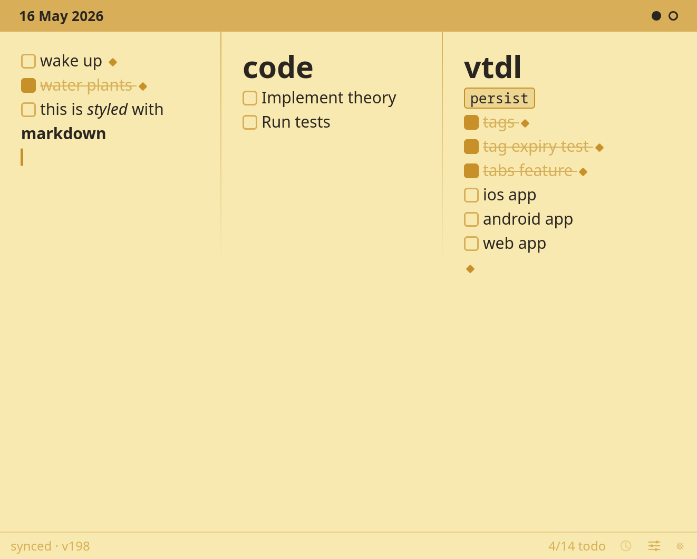
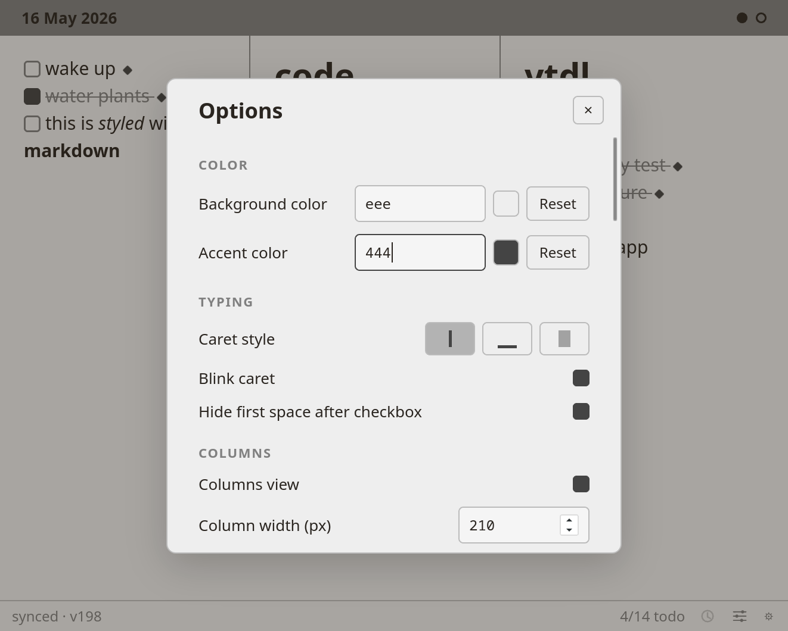
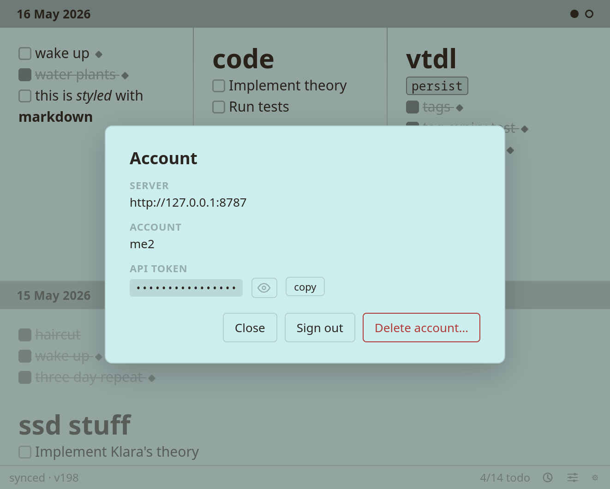

# vtdl
(yet another) vibed to-do list.

I wanted a simple as possible to-do list that still supports cross-device sync, quick navigation, and logical grouping. All logic is done through the text itself.

- simple markdown rendering

- optional encrypted sync through http service

- history and daily task carry-over

- columns and tab grouping (`# header1s` create new columns, ``newtab`` tags create new tabs)

- complex behavior with tags, if needed

- encrypted

- customization

